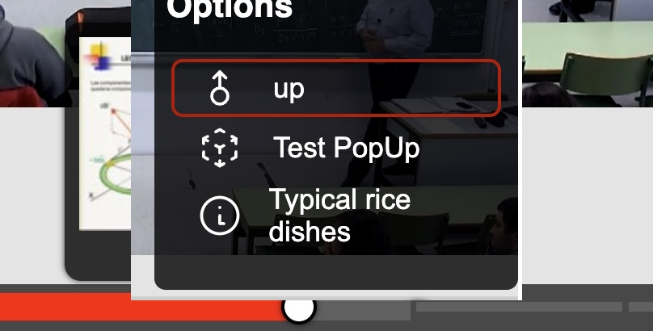
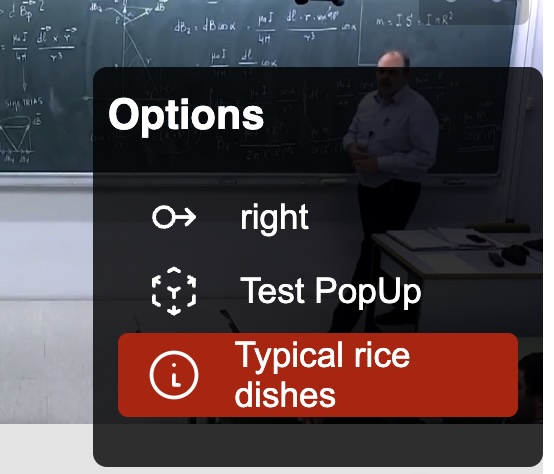
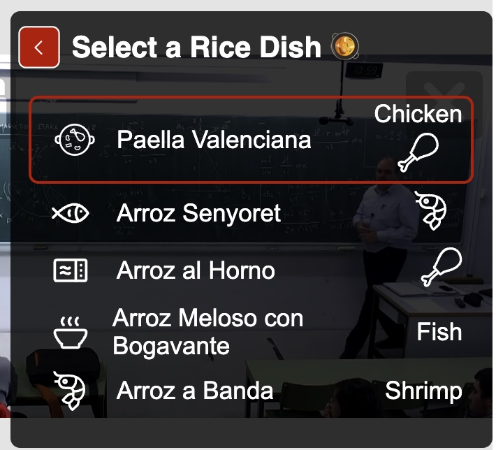
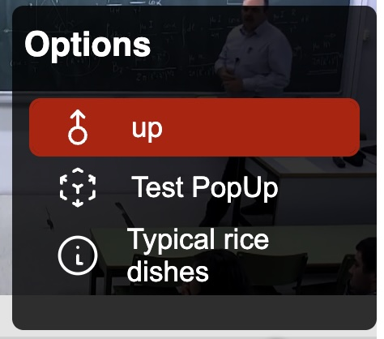
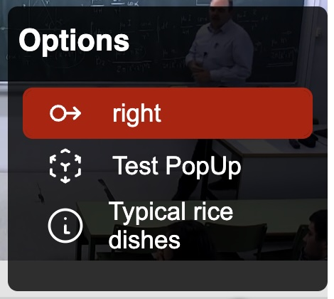
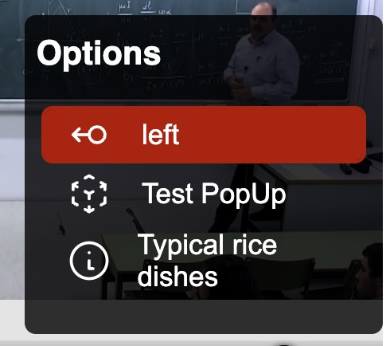
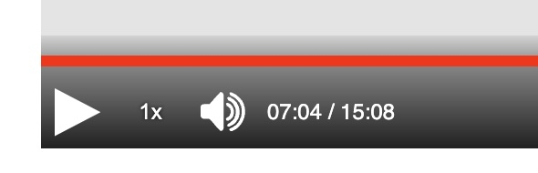

# Migration from paella-core 1.x

The introduction of Paella-Core 2.x brings significant enhancements that necessitate updates to codebases previously utilizing version 1.x. The majority of these changes are driven by the transition to a new building system, as well as substantial improvements in user experience and accessibility.

Key Changes and Migration Considerations

* Scoped packages: The paella-core library and all the plugins packaged are now published under the `@asicupv` scope.
* Building System Overhaul: The most notable change is the adoption of a Vite, which streamlines the development process and enhances overall build performance.
* Enhanced User Experience: paella-core 2.x introduces a range of features designed to improve the user experience, including revamped UI components, enhanced navigation, and more intuitive interaction models.
* Accessibility Improvements: The latest version prioritizes accessibility.

## Paella Player libraries

### Scoped packages

The npm packages related to Paella are now publicly available under the `@asicupv` scope. This means that the package names must be updated to include this scope.

The following packages must be updated to include the `@asicupv` scope in their name:

- `paella-core ->` `@asicupv/paella-core`
- `paella-basic-plugins` -> `@asicupv/paella-basic-plugins`
- `paella-slide-plugins` -> `@asicupv/paella-slide-plugins`
- `paella-user-tracking` -> `@asicupv/paella-user-tracking`
- `paella-zoom-plugin` -> `@asicupv/paella-zoom-plugin`
- `paella-webgl-plugins` -> `@asicupv/paella-webgl-plugins`

### Video formats

A new library called `@asicupv/paella-video-plugins` is introduced, which will contain advanced video formats. This library will be publicly available under the @asicupv scope:

- `HLSVideoFormat`: support for HLS m3u8 video streams.
- `HLSLiveVideoFormat`: support for HLS m3u8 live streams and low latency HLS.
- `MP4MultiQualityFormat`: support for MP4 video playback with dynamic quality change. For dynamic quality change it is still more advisable to use HLS streams, but this can be a compromise solution for organizations that do not have the capacity to re-encode or transcode their video libraries.

In addition to supporting various video formats, a dedicated plugin is provided to enable the display of embedded captions within HLS (HTTP Live Streaming) videos. However, it's essential to note that HLS embedded captions, particularly those generated in real-time, may not be fully compatible with the native captioning system integrated into paella-core.

To address this limitation, our plugin offers a compromise solution. Although it doesn't allow for seamless integration of subtitles with the paella-core system, it does enable the display of embedded captions within HLS videos. This means that users can still benefit from having captions available, even if they are not fully integrated with the paella-core platform.

**Improved code size**: The HLS plugins imports the `hls.js` library dynamically. This avoids the need to load this library if the video format is not HLS.

## Build system

The building system for paella-core 2.x and all its plugin libraries has been changed from Webpack to Vite. This has two implications:

- Importing plugins must be done with the explicit system.
- CSS files must be imported manually

### Plugin import

The introduction of paella-core 2.x brings a significant change to the building system, specifically affecting the way plugins are imported. As of version 2.x, plugins must be imported using explicit import, which replaces the previous implicit import method. The plugin import system of paella-core 1.0 allows to import all plugins of a plugin module using a *plugin context object*. This import system is based on a feature of Webpack, therefore this method of importing plugins has been removed.

Example of Explicit Plugin Importation:

```js
// NOT SUPPORTED: plugin context import
import getBasicPluginsContext from 'paella-basic-plugins';

let paella = new Paella('player-container', {
    customPluginContext: [
        getBasicPluginsContext()
    ]
});
```

```js
// Explicit import:
import { FullscreenButtonPlugin } from '@asicupv/paella-basic-plugins'

const player = new Paella('player-container', {
    plugins: [
        FullscreenButtonPlugin
    ]
})
```

Note that plugin packages may contain an array definition with all the plugins you export. In this case you can easily include all plugins in your player:

```js
import { basicPlugins } from '@asicupv/paella-basic-plugins'

const player = new Paella('player-container', {
    plugins: [
        ...basicPlugins
    ]
})
```

With the explicit plugin import system it is possible to define a default configuration, which will be used in case no configuration for that plugin is found in the player configuration file.

```js
import { FullscreenButtonPlugin } from '@asicupv/paella-basic-plugins'

const player = new Paella('player-container', {
    plugins: [
        {
            plugin: FullscreenButtonPlugin,
            config: {
                enabled: true
            }
        }
    ]
})
```

### Styles

Stylesheets were automatically included by Webpack inside the JavaScript code in version 1.x. This posed some security and performance problems. In version 2.x, with the use of Vite instead of Webpack, style sheets are separated from the JavaScript code. For that reason they have to be explicitly included in the code.

This happens both with paella-core styles and with the styles of those libraries that include style sheets. This is an example of how you should include the style sheets in case you use Vite:

```js
import '@asicupv/paella-basic-plugins/paella-basic-plugins.css';
import '@asicupv/paella-core/paella-core.css';
import '@asicupv/paella-slide-plugins/paella-slide-plugins.css';

...
```

The method of importing style sheets may vary depending on the building system you use in your player. You can also choose to include the style sheets directly in the `html` file.

In any case, this new way of working simplifies the inclusion of custom style sheets, since with the system used in version 1.x it was not easy to predict in which order the CSS files would be included. For this reason, in version 1.x there was a specific API to import custom styles:

```js
import { utils } from 'paella-core';

...

// This will no longer be necessary in version 2.x.
await utils.loadStyle('custom-paella-styles.css');
```

With version 2.x it is no longer necessary to use this API, now it is enough to include the style sheets in the order that suits us best.

```js
import '@asicupv/paella-basic-plugins/paella-basic-plugins.css';
import '@asicupv/paella-core/paella-core.css';
import '@asicupv/paella-slide-plugins/paella-slide-plugins.css';

import "./my-custom-paella-style.css"
...
```

## New repository

The unification of all Paella Player libraries into a single repository has been completed (https://github.com/polimediaupv/paella-player). This move simplifies bug tracking and facilitates the development of libraries and integration of new features.

Although all repositories are now unified, it's worth noting that core library and plugin packages remain independent on npm. This means each package can be installed and updated individually, providing flexibility and easing dependency management.

## Changes in APIs

### Accessibility

Most of the changes have been made to rebuild elements of the player to make it easier to implement keyboard navigation and accessibility. Keyboard navigation between the playbar and timeline elements has been improved, and menu pop-ups have been replaced with a new multi-level menu system.

### New playback and progress bar

The new progress bar has been implemented from a standard `input` element of type `range`. This alone greatly improves accessibility by using standard browser components.

In addition, the new progress bar now features an improved slide marker system, which provides a clearer indication of the video range associated with each slide. This enhancement allows users to more easily navigate through the video content and identify the specific sections corresponding to each slide.



### New menus

Paella Core 2.x has replaced the traditional popup-based menu system with a new multi-level menu system that is statically positioned on the playback bar.




This change brings several benefits, including:

- Native CSS positioning: The new menu system uses native CSS positioning, eliminating the need for JavaScript-based positioning.
- Improved accessibility: Paella Core 2.x has more control over the content displayed in menus, allowing for automatic keyboard navigation management. This significantly improves accessibility without requiring plugin developers to worry about these issues.
- Enhanced usability: The new menu system replaces pop-ups with multi-level menus, improving usability and reducing screen space usage.

All plugins implemented using the MenuButtonPlugin API in Paella Core 1.x will automatically benefit from these changes. However, plugins developed using the PopUpButtonPlugin API will continue to function but will not take advantage of automatic navigation management.

In addition to this, the new menu API incorporates a new element: statuses. With this new API it is possible to maintain a status on menu items, and to modify the menu icon and the status icon.






**Recommendation: Migrate Pop-up Plugins to Menu Plugins**

Whenever possible, it is recommended to migrate pop-up plugins to menu plugins to leverage the benefits of the new menu system. This migration will ensure that your plugins are optimized for accessibility and usability, providing a better experience for users.

### Custom progress bar

Paella Core 2.x now includes a new API that allows developers to create a custom playback bar from scratch. This enables the implementation of new features that are not available in the default playback bar.

To create a new playback bar, you need to implement the `getProgressIndicator` function in the player's initialization object. This function returns an instance of the progress indicator component.

If you want to extend the functionality of the default playback bar instead of creating a completely new one, you can call the `createProgressIndicator` function within your `getProgressIndicator` implementation. This function creates the default progress indicator, which you can then modify as needed.

```js
import { createProgressIndicator } from "@asicupv/paella-core"

const playerConfig = {
  // ...
  getProgressIndicator: () => {
    const defaultProgressIndicator = createProgressIndicator();
    
    // Modify the default progress indicator to add custom features
    
    return defaultProgressIndicator;
  }
};
```

## Customization

The playback bar has undergone significant changes, resulting in new selectors for styling. To simplify customization, we've introduced CSS variables that allow you to personalize colors, positions, sizes, paddings, and more.

Our objective is to enable customization of the playback bar solely through modification of CSS variables. This will allow developers and designers to create a unique appearance without worrying about specific selectors and styles.

Using CSS variables for customization offers flexibility, reusability, and ease of maintenance. We may add new variables in the future to further enhance customization capabilities. For more information on available variables, please refer to our separate documentation.

## Things that have been removed

### Removal of Pop-up API

The Pop-up API has been deprecated and removed. This API was initially introduced for historical reasons, as it was used to implement menus in paella-core 1.x. However, with the introduction of the new multi-level menu system, the need for a separate API to create pop-ups has been eliminated.

Furthermore, the standard HTML dialog element provides a straightforward way to migrate code that previously used Paella's pop-up API. This means that developers can easily transition their existing code to use the native HTML dialog functionality, which offers a more modern and standardized approach to creating interactive dialogs.

Benefits of Removal:

- Simplification of the API: By removing the Pop-up API, the overall API surface area is reduced, making it easier for developers to learn and use.
- Improved Standardization: The use of standard HTML elements, such as dialog, promotes consistency and interoperability across different browsers and platforms.

This change only affects you if you have directly used the APIs to open pop ups. If you had `PopUpButtonPlugin` plugins, they automatically adapt to the new multi-level menu API. However, whenever possible it is recommended to use `MenuButtonPlugin` first, as this will automatically handle keyboard navigation events.


### paella-layout-plugins

The `paella-layout-plugins` repository has been removed. Layout plugins with static position are deprecated in version 2.x, and all layouts in this library were static, so this library will not be migrated for version 2.x. We do not rule out releasing a new layout library for version 2.x, but for the moment we have preferred to include the basic layouts in paella-core.

### Keyboard shortcuts

The keyboard shortcut plugins have been removed from `paella-core` 2.x. The platform now solely manages keyboard navigation through menus.

**Reasoning Behind Removal**

The decision to remove keyboard shortcut management from Paella Core stems from the fact that keyboard control is highly dependent on the specific website implementation. In previous versions of Paella Core (1.x), we encountered issues with websites featuring multiple players on the same page. This complexity made it challenging to manage keyboard shortcuts effectively through plugins.

In contrast, managing keyboard shortcuts directly through the player's APIs provides a more straightforward and efficient approach. By doing so, developers can tailor keyboard control to their specific use case, ensuring a seamless user experience. This change allows for greater flexibility and customization, as developers can now handle keyboard events in a way that best suits their application.

### Progress indicator plugins

In Paella Core 1.x, a plugin system allowed developers to draw custom content on top of the progress bar using a canvas element (Progress Indicator Plugins). However, this feature was only used for displaying the slide time markers, and its complexity made it difficult to adapt to different visual styles using CSS. The API was limited to drawing content using the canvas context, which restricted its flexibility. Progress Indicator Plugins Limitations:

- Complexity: The plugin system was overly complex, making it challenging to implement and maintain.
- Limited styling options: The use of a canvas element made it difficult to apply CSS styles, limiting the ability to customize the appearance of the progress bar.
- Limited functionality: Despite its complexity, the plugin system was only used for displaying time markers, which is now handled more efficiently by the new slide marker system.

For developers who require advanced customization options, the new progress bar API allows for complete personalization of the component. This API provides a more flexible and efficient way to implement custom functionality, making it easier to adapt the progress bar to specific use cases.

### Current time label over the playback bar



The new playback bar in Paella Core 2.x no longer displays the current time indicator on the progress bar. This feature was becoming increasingly less used due to accessibility issues and visual clutter, particularly in videos with multiple slides:

- Visual overload: The presence of multiple time markers on the progress bar could lead to visual confusion, making it difficult for users to focus on the current time.
- Insufficient contrast: In some cases, the time marker may not have provided sufficient contrast with the surrounding elements, further exacerbating accessibility issues.

In Paella Core 2.x, the current time is now displayed through a plugin that can be activated in the button area of the playback bar. This plugin offers the same alignment options as other buttons, allowing for flexible placement and customization. This new approach has several advantages:

- Improved accessibility: By removing the time indicator from the progress bar, Paella Core 2.x reduces visual clutter and improves overall accessibility.
- Enhanced flexibility: The new plugin-based approach allows users to customize the display of the current time, choosing from various alignment options to suit their needs.
- Simplified design: The removal of the time indicator from the progress bar results in a cleaner, more streamlined design that focuses on essential playback controls.
Plugin-Based Solution

