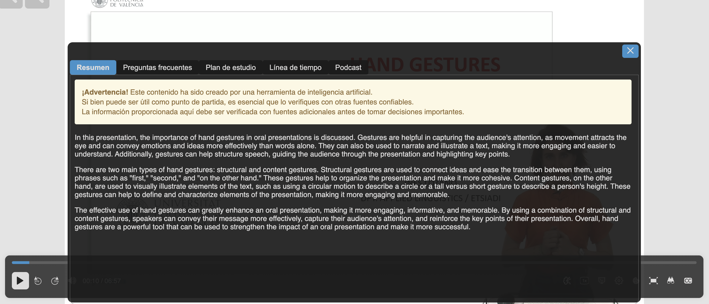

# paella-ai-plugins

## Description

The `paella-ai-plugins` plugin provides Paella plugins related to artificial intelligence.

## Installation

Install the plugin via npm:

```bash
npm install @asicupv/paella-ai-plugins
```

## Plugins

- [es.upv.paella.ai.content](#esupvpaellaaicontent)
- [es.upv.paella.ai.content.data-test](#esupvpaellaaicontentdata-test)

## es.upv.paella.ai.content

The `es.upv.paella.ai.content` plugin provides AI-generated content to enhance the user experience in the Paella Player. This content includes summaries, key questions, study plans, timelines, and podcasts.

### Features

- AI-powered generation of useful content.
- Access to summaries, FAQs, study plans, and more.
- Configurable interaction modes: `"dialog"` or `"popup"`.
- Seamless integration with the player to display relevant content.

### Usage

#### Step 1: Import the plugin and CSS

```typescript
import { AIContentPlugin } from '@asicupv/paella-ai-plugins';
import '@asicupv/paella-ai-plugins/es.upv.paella.aitools.css';
```

#### Step 2: Add the plugin to the Paella Player configuration

```typescript
let paella = new Paella('player-container', {
    plugins: [
        {
            plugin: AIContentPlugin,
            config: {
                mode: "dialog"
            }
        }
    ]
});
```

### Configuration

The plugin can be configured in the `config.json` file:

```json
{
    "plugins": {
        "es.upv.paella.ai.content": {
            "mode": "dialog"
        }
    }
}
```

#### Options

- `mode`: Defines the interaction mode of the plugin. It can be `"dialog"` or `"popup"`.

### Screenshots

#### Example of generated content


## es.upv.paella.ai.content.data-test

The `es.upv.paella.ai.content.data-test` plugin allows loading test data for AI-generated content from files configured in the system.

### Configuration

The plugin can be configured in the `config.json` file:

```json
{
    "plugins": {
        "es.upv.paella.ai.content.data-test": {
            "enabled": true,
            "context": ["ai.content"],
            "files": {
                "summary": {
                    "file": "summary.txt",
                    "media": "summary.mp3"
                },
                "faq": {
                    "file": "faq.txt"
                }
            }
        }
    }
}
```

#### Options

- `enabled`: Enables or disables the plugin.
- `context`: Specifies the contexts supported by the plugin. For example, `"ai.content"`.
- `files`: Defines the test files containing AI-generated content. Each entry includes:
  - `file`: Name of the file containing the content.
  - `media`: (Optional) Multimedia file associated with the content.