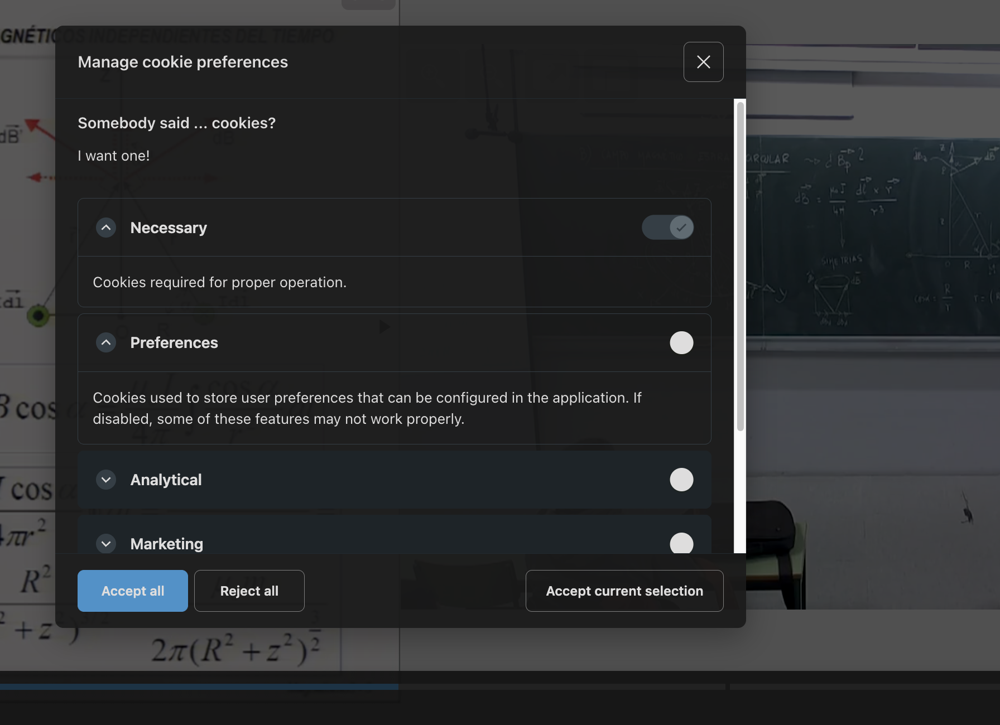

# paella-extra-plugins

A extra plugin set for Paella Player


## Installation

Install the plugin via npm:

```bash
npm install @asicupv/paella-extra-plugins
```


# es.upv.paella.cookieConsent Plugin

A plugin to manage cookie consent in Paella Player.

This plugin is useful when the site integrating Paella Player does not already have a way to manage cookie consent. If the site already handles cookie consent, you should implement the `getCookieConsentFunction` from `PaellaInitParams`. For more details on how to implement this function, refer to the Paella documentation.

## Description

The `es.upv.paella.cookieConsentPlugin` displays a cookie consent banner in the video player. 

### Step 1: Import the plugin and CSS

```typescript
import { CookieConsentPlugin } from '@asicupv/paella-extra-plugins';
import '@asicupv/paella-extra-plugins/paella-extra-plugins.css';
```


### Step 2: Add the plugin and configure the `cookieConsent` property into the Paella Player configuration

```typescript
let paella = new Paella('player-container', {
    "cookieConsent": [
        {
            "type": "necessary",
            "title": "Necessary",
            "description": "Cookies required for proper operation.",
            "required": true
        },
        {
            "type": "preferences",
            "title": "Preferences",
            "description": "Cookies used to store user preferences that can be configured in the application. If disabled, some of these features may not work properly.",
            "required": false
        },
        {
            "type": "analytical",
            "title": "Analytical",
            "description": "Cookies used to analyze user behavior and thus provide clues about future improvements in the application.",
            "required": false
        },
        {
            "type": "marketing",
            "title": "Marketing",
            "description": "Cookies used to better tailor ads to user preferences.",
            "required": false
        }
    ],
    ...
    plugins: [
        {
            plugin: CookieConsentPlugin,
            config: {
                enabled: true
            }
        }
    ]
});
```


## Step 3: Add the `getCookieConsentFunction` function to the `InitParams` when creating the player.

The `getCookieConsentFunction` is used to retrieve the user's cookie consent preferences. This function must be passed as part of the initialization parameters when creating the Paella Player instance.

```javascript
import { getCookieConsentFunction } from 'paella-extra-plugins';

const player = new Paella('playerContainer', {
    getCookieConsentFunction: getCookieConsentFunction,
    ...
});
```

This function ensures that the plugins and features in Paella Player respect the user's cookie preferences, such as enabling or disabling specific functionalities based on the consent type.


### Icon Customization

- Plugin identifier: `es.upv.paella.cookieConsentPlugin`
- Icon name:
    * `cookieIcon`

## Example

```json
{
    "cookieConsent": [
        {
            "type": "necessary",
            "title": "Necessary",
            "description": "Cookies required for proper operation.",
            "required": true
        },
        {
            "type": "preferences",
            "title": "Preferences",
            "description": "Cookies used to store user preferences that can be configured in the application. If disabled, some of these features may not work properly.",
            "required": false
        },
        {
            "type": "analytical",
            "title": "Analytical",
            "description": "Cookies used to analyze user behavior and thus provide clues about future improvements in the application.",
            "required": false
        },
        {
            "type": "marketing",
            "title": "Marketing",
            "description": "Cookies used to better tailor ads to user preferences.",
            "required": false
        }
    ],
    "plugins": {
        "es.upv.paella.cookieConsentPlugin": {
            "enabled": true
        }
    }
}
```

### Screenshot



# es.upv.paella.onboarding Plugin

## Description

The `es.upv.paella.onboarding` provides an interactive tutorial for users to familiarize themselves with the features of the Paella Player. It uses the `shepherd.js` library to create guided tours.

## Features

- Step-by-step tutorial for navigating the player.
- Highlights key elements of the player interface.
- Option to disable the tutorial permanently.


## Usage

### Step 1: Import the plugin and CSS

```typescript
import { OnboardingPlugin } from '@asicupv/paella-extra-plugins';
import '@asicupv/paella-extra-plugins/paella-extra-plugins.css';
```

### Step 2: Add the plugin to the Paella Player configuration

```typescript
let paella = new Paella('player-container', {
    plugins: [
        {
            plugin: OnboardingPlugin,
            config: {
                enabled: true
            }
        }
    ]
});
```


## Configuration

The plugin can be configured in the `config.json` file:

```json
{
    "plugins": {
        "es.upv.paella.onboarding": {
            "enabled": true
        }
    }
}
```

### Options

- `enabled`: Enable or disable the plugin.

## Screenshots

### Example of a tutorial step


## Dependencies

- [shepherd.js](https://shepherdjs.dev/): Library for creating guided tours.

