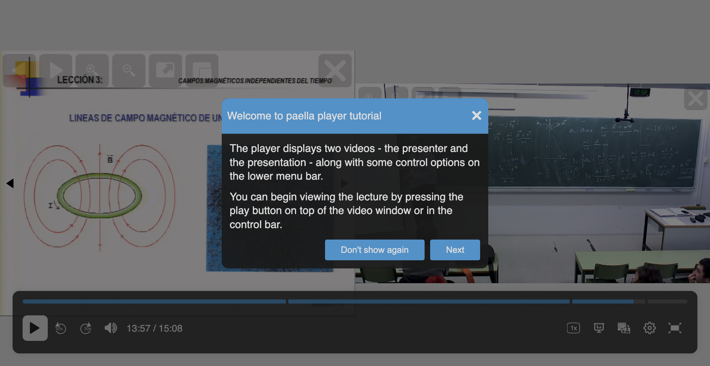

# paella-onboarding-plugin

## Description

The `paella-onboarding-plugin` provides an interactive tutorial for users to familiarize themselves with the features of the Paella Player. It uses the `shepherd.js` library to create guided tours.

## Features

- Step-by-step tutorial for navigating the player.
- Highlights key elements of the player interface.
- Option to disable the tutorial permanently.

## Installation

Install the plugin via npm:

```bash
npm install @asicupv/paella-onboarding-plugin
```

## Usage

### Step 1: Import the plugin and CSS

```typescript
import { OnboardingPlugin } from '@asicupv/paella-onboarding-plugin';
import '@asicupv/paella-onboarding-plugin/paella-onboarding-plugin.css';
```

### Step 2: Add the plugin to the Paella Player configuration

```typescript
let paella = new Paella('player-container', {
    plugins: [
        {
            plugin: OnboardingPlugin,
            config: {
                enabled: true
            }
        }
    ]
});
```


## Configuration

The plugin can be configured in the `config.json` file:

```json
{
    "plugins": {
        "es.upv.paella.onboarding": {
            "enabled": true
        }
    }
}
```

### Options

- `enabled`: Enable or disable the plugin.

## Screenshots

### Example of a tutorial step


## Dependencies

- [shepherd.js](https://shepherdjs.dev/): Library for creating guided tours.

